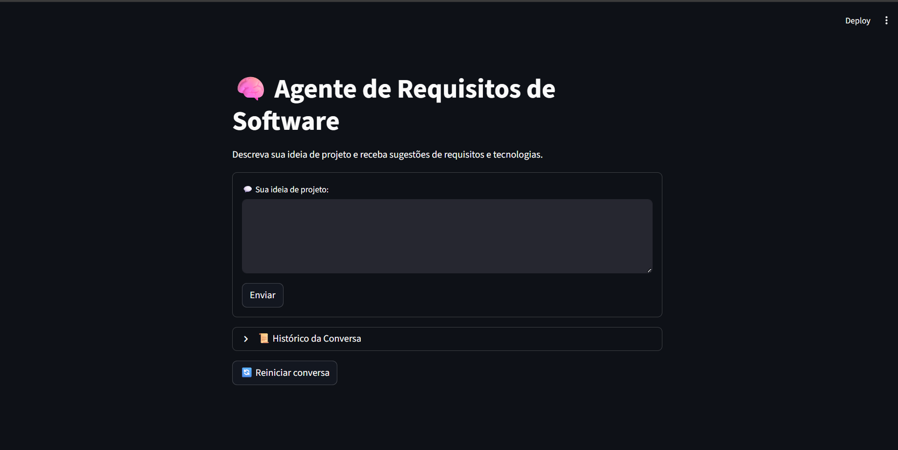

---

# 🤖 Agent Demo 1.0

Agente de Requisitos de Software que converte ideias de produto/negócio em **documentação estruturada de requisitos, arquitetura e MVP**.

---

# 📌 1. Descrição do Projeto

Este projeto é um **protótipo de agente de requisitos** capaz de transformar textos livres em documentação técnica organizada.

### 🎯 Objetivos

* Converter ideias em **requisitos estruturados**
* Gerar **requisitos funcionais e não funcionais**
* Sugerir **arquitetura do sistema**
* Criar **roadmap inicial (MVP)**
* Permitir **iteração rápida via interface web**
* Manter o prompt centralizado em
  `sobre o prompt/SOBRE_O_PROMPT.md`

---

# 🧰 2. Tecnologias Utilizadas

* Python 3.11+
* Streamlit (Interface Web)
* LangChain
* Groq + Llama-3 (LLM configurável)
* Estrutura modular em Python

Arquivos principais:

* `app/app.py`
* `app/agente_v0_1.py`

---

# 🏗️ 3. Arquitetura do Repositório

```bash

Agent_demo_0.1
│
├── app/
│   ├── app.py              # Interface Streamlit
│   └── agente_v0_1.py      # Lógica do agente + prompt
│
├── imgs/
│   └── interface.png       # Screenshot da UI
│
├── sobre o prompt/
│   └── SOBRE_O_PROMPT.md   # Instruções do agente
│
└── requirements.txt        # Dependências Python
```

---

# 🖥️ 4. Interface



---

# ⚙️ 5. Instalação

### 1. Clonar o repositório

```bash
git clone https://seurepositorio.git
cd Agent_demo_0.1
```

---

### 2. Criar ambiente virtual (Windows)

```powershell
python -m venv .venv
.\.venv\Scripts\Activate.ps1
```

---

### 3. Instalar dependências

```bash
pip install -r requirements.txt
```

---

### 4. Configurar variável de ambiente

```powershell
setx GROQ_API_KEY "seu_token_groq_aqui"
```

---

### 5. Executar aplicação

```bash
streamlit run app/app.py
```

Acesse no navegador:

```
http://localhost:8501
```

---

# 🚀 6. Como Usar

Fluxo básico:

1. Inserir descrição da ideia/projeto
2. Enviar para o agente
3. Receber requisitos estruturados
4. Ajustar o texto (opcional)
5. Reexecutar para refinar saída

---

# 🧠 7. Prompt do Agente

O comportamento do agente é definido em:

```
sobre o prompt/SOBRE_O_PROMPT.md
```

Ou diretamente:

[Ver Prompt do Agente](Agent_demo_1.0/sobre%20o%20prompt/SOBRE_O_PROMPT.md)

---

# 👤 8. Autor

**Samuel de Andrade da Silva**

---

# 🛠️ 9. Boas Práticas

* Não versionar `.env` ou chaves de API
* Manter `requirements.txt` atualizado
* Ajustar o prompt para novos domínios
* Validar saídas antes de uso em produção

---

# 📌 Status do Projeto

🧪 Protótipo funcional
🔄 Iteração manual
🧠 Prompt centralizado
💻 Interface local Streamlit

---


